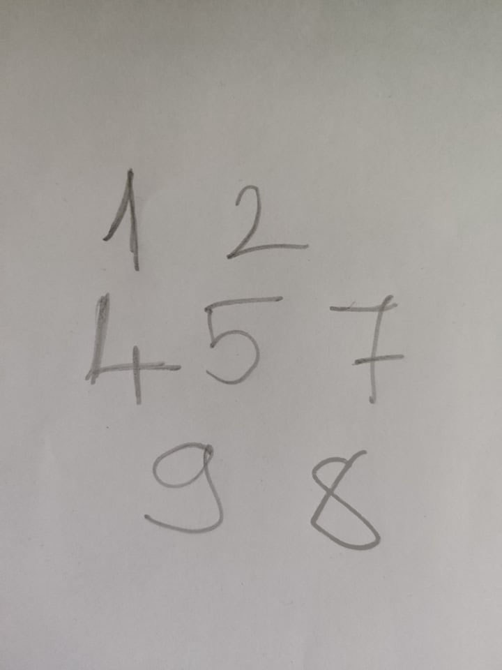

# Hand writing recognition

In this project I take an image of handwritten numbers,
and highlight each one of them using their contours.

## Requirements
- openCV 4.5.5
- numpy 1.21.5

## The Process

We start with an image of handwritten numbers.

We crop the image, and apply thresholding to create white characters on black background.

After thresholding, we are removing the white dots, and thickening the white lines.
This will help us in creating their contour, which we can apply to the original image.

    TO-DO :
    - Highlight the contoured numbers one-by-one.
    - Save the numbers into separate files.
    

